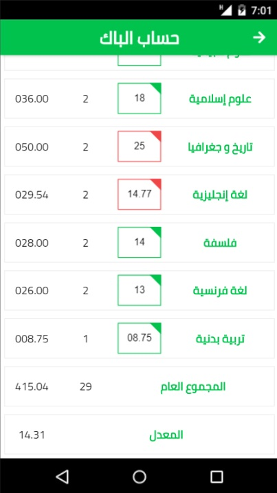

# BAC Average Calculator (حساب معدل الباك)

This is a project i did on my free time, and it is called **BAC Average Calculator (حساب معدل الباك)**.

Check out this project on [GitHub Pages](https://al-yasa.github.io/bac-average-calculator/ "BAC Average Calculator - Belhenniche Al-Yasa'").

## Description


A baccalaureate average calculator app that is based on the Algerian curriculum.

This application allow you to calculate your BAC average by choosing a branch then adding your exam marks for each subject, the app will display your average.

The project emphasizes using React to build a single page application.





### Built With

- Javascript (Programming Language)

    - [React](https://reactjs.org/) (A JavaScript library for building UI)

        - react-dom, react-router, react-router-dom, react-icons, react-scripts, prop-types

- [Cmder](https://cmder.net/) (console emulator for Windows)

    - [create-react-app](https://github.com/facebookincubator/create-react-app) (React project scaffolding manager)

    - [git](https://git-scm.com/downloads) (Version control system)

        - gh-pages

    - [npm](https://nodejs.org/en/download/) (Javascript package manager)

- [VSCode](https://code.visualstudio.com/) (Free. Open source code editor)

- HTML5/CSS3 (Markup/Styling languages)

    - node-sass

### What You're Getting

```bash
├── CONTRIBUTING.md
├── README.md - This file.
├── package.json # npm package manager file. It's unlikely that you'll need to modify this.
├── public
│   ├── 404.html # HTML file for fixing github-pages single page application routing.
│   ├── favicon.ico # App Icon, You may change if you wish.
│   ├── icon-192.png # App Icon for manifest file.
│   ├── icon-512.png # App Icon for manifest file.
│   ├── manifest.json # Meta data for the app.
│   └── index.html # DO NOT MODIFY
└── src
    ├── App.sass # Styles for your app. Feel free to customize this as you desire.
    ├── App.js # This is the root of your app. Contains static HTML right now.
    ├── data
    │   ├── Branches.json # A JSON file containing all the branches
    ├── components # The building blocks of the app
    │   ├── CalcPage.js # A class component that holds the calculations logic
    │   └── MainPage.js # A class component that displays all branches and optional subjects
    ├── styles # The styling of the app
    ├── index.sass # Global styles. You probably won't need to change anything here.
    └── index.js # You should not need to modify this file. It is used for DOM rendering only.
```

## Usage

You can run the app locally or online.

If you want to run online you have to visit this project on [GitHub Pages](https://al-yasa.github.io/bac-average-calculator/ "BAC Average Calculator - Belhenniche Al-Yasa'").

If you want to run locally you have to download the app first:

### Method 1:

1. Click on the green `Clone or download` button above.

2. Click on `Download ZIP`.

3. Extract downloaded Zip file.

4. Install all project dependencies with `npm install`.

5. Run server with `npm start`.

6. With your server running, visit the site: `http://localhost:3000`.

### Method 2:

1. If you have git installed you can clone this repo to your desktop by running this command line:
`git clone https://github.com/Al-Yasa/bac-average-calculator.git`

2. Install all project dependencies with `npm install`.

3. Run server with `npm start`.

4. With your server running, visit the site: `http://localhost:3000`.
